# 🔐 Sistema de Control de Accesos

> **Control de Accesos** es una aplicación web desarrollada en **Laravel 13** para la gestión integral de accesos físicos a instalaciones. Permite registrar, controlar y evaluar la entrada y salida de personas, gestionar actividades, asignar casilleros y generar reportes personalizados.

---

## 📋 Tabla de Contenidos

- [Descripción General](#-descripción-general)
- [Stack Tecnológico](#-stack-tecnológico)
- [Requisitos Previos](#-requisitos-previos)
- [Instalación](#-instalación)
- [Configuración de Entorno](#-configuración-de-entorno)
- [Docker](#-docker)
- [Pruebas y Calidad de Código](#-pruebas-y-calidad-de-código)
- [Despliegue (Opcional)](#-despliegue-opcional)
- [Estructura del Proyecto](#-estructura-del-proyecto)
- [Rutas de la API](#-rutas-de-la-api)
- [Exportaciones y Reportes](#-exportaciones-y-reportes)
- [Panel de Administracion](#-panel-de-administracion)
- [Modelo de Datos](#-modelo-de-datos)

---

## 🗄️ Descripción General

El sistema permite a los administradores:

- Registrar personas y sus tipos de identificación.
- Gestionar actividades (instantáneas y programadas) y asignar casilleros.
- Monitorizar accesos en tiempo real con estadísticas y historiales.
- Generar reportes en PDF y Excel/CSV.
- Evaluar el servicio mediante una calificación de 1 a 5 estrellas.
- Administrar usuarios y roles en el panel de administración.

---

## 🛠️ Stack Tecnológico

### Backend
| Tecnología | Versión | Propósito |
|------------|---------|-----------|
| **Laravel** | ^13.0 | Framework MVC principal |
| **PHP** | ^8.3 | Lenguaje de programación |
| **MySQL** | - | Base de datos relacional |
| **DOMPDF** (barryvdh) | ^3.1 | Generación de reportes PDF |
| **Laravel Excel** (maatwebsite) | ^3.1 | Exportación a Excel/CSV |

### Frontend
| Tecnología | Versión | Propósito |
|------------|---------|-----------|
| **AdminLTE** | ^4.0.0-rc7 | Template administrativo |
| **Bootstrap** | ^5.3.8 | Framework CSS |
| **Tailwind CSS** | ^4.0 | Estilos utilitarios |
| **Vite** | ^8.0 | Bundler de assets |
| **jQuery** | ^4.0 | Manipulación del DOM |
| **Chart.js** | ^4.5.1 | Gráficos y estadísticas |
| **FullCalendar** | ^6.1.20 | Calendario de actividades |
| **Font Awesome** | ^7.2.0 | Iconografía |

---

## ⚙️ Configuración de Entorno

Edita el archivo `.env` con los valores correspondientes a tu entorno:

```dotenv
APP_NAME="Control de Accesos"
APP_URL=http://localhost
DB_CONNECTION=mysql
DB_HOST=127.0.0.1
DB_PORT=3306
DB_DATABASE=control_accesos
DB_USERNAME=root
DB_PASSWORD=
MAIL_MAILER=smtp
MAIL_HOST=smtp.mailtrap.io
MAIL_PORT=25065
MAIL_USERNAME=null
MAIL_PASSWORD=null
MAIL_ENCRYPTION=null
```

> **Nota:** Si usas SQLite para desarrollo, define `DB_CONNECTION=sqlite` y `DB_DATABASE=/ruta/a/database.sqlite`.

---

## 🐳 Docker

El proyecto incluye una configuración completa de Docker con **multi-stage build** que levanta la aplicación junto con una base de datos MySQL 8.0 listos para usar.

### Requisitos

- [Docker](https://docs.docker.com/get-docker/) ≥ 24.x
- [Docker Compose](https://docs.docker.com/compose/install/) ≥ 2.x (incluido en Docker Desktop)

### Inicio rápido

```bash
# 1. Clonar el repositorio
git clone https://github.com/tu-usuario/control-accesos.git
cd control-accesos

# 2. Levantar contenedores (construye la imagen la primera vez)
docker compose up -d

# 3. Listo! Abrir en el navegador
# http://localhost:8000
```

> **Nota:** La primera ejecución tarda entre 2-5 minutos mientras se construyen las imágenes (Node.js para assets, Composer para dependencias PHP, y la imagen final con PHP 8.3 + Apache).

### Qué hace el entrypoint automáticamente

El archivo `docker-entrypoint.sh` ejecuta los siguientes pasos al iniciar el contenedor:

1. **Crea el archivo `.env`** con las variables de entorno configuradas en `docker-compose.yml` (si no existe).
2. **Genera `APP_KEY`** automáticamente.
3. **Espera a que MySQL esté listo** antes de continuar.
4. **Ejecuta `migrate:fresh`** para crear todas las tablas y poblar los datos de prueba (seeders).
5. **Crea el symlink** de `storage:link` y limpia cachés.

> ⚠️ **Importante:** El entrypoint ejecuta `migrate:fresh`, lo que **elimina y recrea** la base de datos en cada inicio. Esto es intencional para desarrollo. Si necesitas preservar datos, modifica el entrypoint.

### Arquitectura de contenedores

```
┌─────────────────────────────────────┐
│           Docker Compose            │
├──────────────────┬──────────────────┤
│   app:8000→80    │     db:3306      │
│   PHP 8.3+Apache │   MySQL 8.0      │
│   Laravel app    │   DB: control_   │
│                  │   accesos        │
└──────────────────┴──────────────────┘
```

| Servicio | Puerto | Descripción |
|----------|--------|-------------|
| **app** | `localhost:8000` | Aplicación Laravel (PHP + Apache) |
| **db** | `localhost:3306` | Base de datos MySQL 8.0 |

### Variables de entorno (Docker)

Las variables se configuran en `docker-compose.yml` dentro del servicio `app`:

```yaml
environment:
  DB_HOST: db          # Nombre del servicio Docker
  DB_PORT: 3306
  DB_DATABASE: control_accesos
  DB_USERNAME: control_accesos
  DB_PASSWORD: secret
```

### Comandos útiles

```bash
# Ver logs de la aplicación
docker compose logs -f app

# Ver logs de MySQL
docker compose logs -f db

# Ejecutar Artisan dentro del contenedor
docker compose exec app php artisan <comando>

# Ejecutar una migración manual
docker compose exec app php artisan migrate

# Acceder al contenedor de la app
docker compose exec app bash

# Acceder a MySQL directamente
docker compose exec db mysql -u control_accesos -psecret control_accesos

# Detener todos los contenedores
docker compose down

# Detener y eliminar volúmenes (limpiar datos)
docker compose down -v

# Reconstruir imágenes (después de cambios en Dockerfile)
docker compose up -d --build
```

### Conexión externa a MySQL

Si necesitas conectarte a la base de datos desde una herramienta externa (MySQL Workbench, DBeaver, etc.):

| Parámetro | Valor |
|-----------|-------|
| Host | `127.0.0.1` |
| Port | `3306` |
| Database | `control_accesos` |
| Username | `control_accesos` |
| Password | `secret` |

### Solucionar conflicto de puerto MySQL

Si el puerto `3306` ya está en uso (por otra instancia de MySQL local), cambia el mapeo de puertos en `docker-compose.yml`:

1. **Modificar el puerto en `docker-compose.yml`:**

```yaml
services:
  db:
    ports:
      - "3307:3306"   # Usar 3307 (o cualquier puerto libre) en vez de 3306
```

2. **Actualizar la variable `DB_PORT` en la sección `environment` del servicio `app`:**

```yaml
services:
  app:
    environment:
      DB_HOST: db
      DB_PORT: 3307     # Debe coincidir con el puerto externo configurado arriba
      DB_DATABASE: control_accesos
      DB_USERNAME: control_accesos
      DB_PASSWORD: secret
```

3. **Actualizar la conexión externa (si usas MySQL Workbench o similar):**

   - Port: `3307` (o el que hayas elegido)

4. **Reiniciar los contenedores:**

```bash
docker compose down
docker compose up -d --build
```

> **Nota:** El puerto `3306` dentro del contenedor de MySQL **no se cambia**. Solo se modifica el mapeo externo (`HOST:CONTAINER`).

## 🧪 Pruebas y Calidad de Código

| Herramienta | Propósito |
|------------|-----------|
| **PHPUnit** | Pruebas unitarias y de integración |
| **Pestphp** | Pruebas con sintaxis más concisa |
| **Laravel Pint** | Formateo automático del código |
| **Laravel Debugbar** (dev) | Depuración visual en entorno local |

Ejecuta las pruebas con:
```bash
php artisan test
```

---

## 📦 Despliegue (Opcional)

Para entornos de producción puedes considerar:

- **Laravel Forge** o **Vapor** para despliegues en servidores gestionados.
- **Docker**: consulta la sección [Docker](#-docker) para la configuración completa.
- **Servidor Nginx/Apache**: configurar virtual host apuntando a `public/`.

---

## 📁 Estructura del Proyecto

El proyecto sigue la convención de Laravel, organizada en directorios lógicos:

### 📁 `app/`
- **Http/Controllers/**:
- **Admin/**: controladores del panel administrativo (`UsuarioController`, `ActividadController`, `AccesoController`, etc.).
- **Models/**: cada entidad del dominio (ej. `Acceso.php`, `Actividad.php`, `Persona.php`, `Usuario.php`).
- **Services/**: lógica de negocio segmentada (`AccesoService.php`, `CalificacionService.php`, `IngresoService.php`, etc.).
- **Providers/AppServiceProvider.php**: registro de servicios y eventos.

### 📁 `database/`
- **migrations/**: archivos de migración para crear/aleterar tablas (`2026_04_29_*.php`).
- **seeders/**: datos de prueba por tabla (`AccesoSeeder.php`, `UsuarioSeeder.php`, etc.).
- **modelo.mwb**: modelo entidad‑relación creado en MySQL Workbench.

### 📁 `config/`
- Archivos de configuración (`acceso.php`, `app.php`, `database.php`, `mail.php`, etc.) que permiten ajustar comportamientos sin tocar código.

### 📁 `resources/`
- **views/**: archivos Blade con la UI (`actividad`, `calificacion`, `ingreso`, `registro`, `salida`, `layouts`).
- **js/**: scripts frontend (`app.js`, `calendario.js`).
- **css/**: estilos básicos y compilados por Tailwind/Vite.

### 📁 `public/`
- Archivos estáticos accesibles directamente (`index.php`, `favicon.ico`, etc.) y la carpeta de AdminLTE (`public/adminlte`).

### 📁 `routes/`
- **web.php**: rutas web de la aplicación.
- **console.php**: comandos Artisan personalizados.

### 📁 Otros archivos clave
- `.env`: variables de entorno esenciales.
- `composer.json` / `package.json`: dependencias de PHP y Node.
- `artisan`: CLI de Laravel.
- `phpunit.xml`: configuración de pruebas.

---

## 📡 Rutas de la API

### Rutas Públicas

| Método | URI | Controlador | Descripción |
|--------|-----|-------------|-------------|
| GET | `/` | `AccesoController@index` | Página principal |
| POST | `/ingreso/iniciar/{tipo}` | `AccesoController@iniciarFlujo` | Iniciar flujo de ingreso |
| GET | `/ingreso/identificar` | `AccesoController@identificar` | Formulario de identificación |
| POST | `/ingreso/buscar` | `AccesoController@buscarUsuario` | Buscar por documento |
| GET | `/ingreso/confirmacion` | `AccesoController@confirmacion` | Confirmar ingreso |
| GET | `/actividad/index` | `ActividadController@index` | Seleccionar actividad |
| POST | `/actividad/confirmar` | `ActividadController@confirmar` | Confirmar actividad |
| GET | `/salida/index` | `SalidaController@index` | Vista de salida |
| POST | `/salida/registrar` | `SalidaController@registrar` | Registrar salida |
| GET | `/calificacion/index` | `CalificacionController@index` | Formulario calificación |
| POST | `/calificacion/guardar` | `CalificacionController@guardar` | Guardar calificación |
| GET | `/registro/create` | `RegistroController@create` | Formulario registro |
| POST | `/registro/store` | `RegistroController@store` | Guardar registro |

### Rutas de Admin

| Método | URI | Controlador | Descripción |
|--------|-----|-------------|-------------|
| GET | `/admin/login` | `AuthController@index` | Login admin |
| POST | `/admin/login` | `AuthController@login` | Procesar login |
| POST | `/admin/logout` | `AuthController@logout` | Cerrar sesión |
| GET | `/admin/dashboard` | `DashboardController@index` | Dashboard |
| GET | `/admin/usuarios` | `UsuarioController@index` | Lista usuarios |
| GET | `/admin/usuarios/{id}` | `UsuarioController@show` | Detalle usuario |
| PUT | `/admin/usuarios/{id}` | `UsuarioController@update` | Actualizar usuario |
| GET | `/admin/actividades` | `ActividadController@index` | Gestión actividades |
| POST | `/admin/actividades/programar` | `ActividadController@programar` | Programar actividad |
| PUT | `/admin/actividades/actualizar` | `ActividadController@actualizar` | Actualizar actividad |
| DELETE | `/admin/actividades/eliminar` | `ActividadController@eliminar` | Cancelar actividad |
| GET | `/admin/accesos` | `AccesoController@index` | Lista accesos |
| GET | `/admin/accesos/{acceso}` | `AccesoController@show` | Detalle acceso |

---

## 📂 Exportaciones y Reportes

| Tipo | Ruta | Controlador | Descripción |
|------|------|-------------|-------------|
| PDF | `/admin/reportes/resumen` | `AccesoReporteController@resumen` | Reporte resumen con KPIs |
| PDF | `/admin/reportes/flujo` | `AccesoReporteController@flujo` | Flujo de accesos por hora |
| CSV/Excel | `/admin/reportes/actividades` | `AccesoReporteController@actividadesUsadas` | Ranking de actividades usadas |
| CSV/Excel | `/admin/reportes/historico` | `AccesoReporteController@historico` | Historico de accesos filtrable |
| PDF | `/admin/reportes/locaciones` | `AccesoReporteController@locacionesOcupacion` | Ocupación por locación |

---

## 👑 Panel de Administracion

### Acceso
- **URL**: `/admin/login`
- **Autenticación**: Custom con `AuthService`
- **Protección**: Middleware `auth.dashboard` + rol `1`

### Secciones
| Sección | Descripción |
|--------|-------------|
| **Dashboard** | Estadisticas en tiempo real y accesos activos |
| **Usuarios** | CRUD de usuarios del sistema administrativo |
| **Actividades** | Programacion con calendario (FullCalendar) |
| **Accesos** | Vista general con filtros por estado y fecha |
| **Casilleros** | Gestion de casilleros disponibles |
| **Reportes** | Resumen, flujo, historico, actividades, ocupacion |
| **Exportar** | Exportacion a PDF y Excel/CSV |
| **Ajustes** | Configuracion de perfil y cambio de contrasena |

### Rutas de Admin (ejemplos)
- GET `/admin/dashboard`
- GET `/admin/usuarios`
- POST `/admin/actividades/programar`
- DELETE `/admin/actividades/eliminar`
- GET `/admin/accesos`

---

## 🗄️ Modelo de Datos

El sistema cuenta con **15 tablas** en la base de datos:

| Entidad | Descripción |
|---------|-------------|
| **tipo_identificacion** | Tipos de documento (CC, NIT, Pasaporte, etc.) |
| **roles** | Roles de usuario para control de permisos |
| **departamento** | Divisiones geográficas departamentales |
| **municipio** | Municipios vinculados a departamentos |
| **personas** | Individuos registrados (visitantes, miembros, colaboradores) |
| **usuarios** | Cuentas de acceso al panel administrativo |
| **locacion** | Instalaciones o sedes físicas |
| **tipos_actividad** | Categorías de actividad (instantánea, programable) |
| **actividades** | Actividades disponibles para realizar |
| **casilleros** | Casilleros asignables durante el acceso |
| **accesos** | Registro central de entradas y salidas |
| **accesos_olvidados** | Accesos cerrados forzosamente por el sistema |
| **calificaciones** | Evaluaciones del servicio (1-5 estrellas) |
| **sessions** | Almacenamiento de sesiones |
| **cache** | Caché de la aplicación |

---

## 🔄 Flujo de Operación

```
INICIO >> IDENTIFICAR >> ACTIVIDAD >> CASILLERO >> CONFIRMAR >> SALIDA >> CALIFICAR
```

1. **Identificación**: La persona ingresa su número de documento.
2. **Verificación**: El sistema busca a la persona. Si no existe, redirige al registro.
3. **Actividad**: La persona selecciona la actividad a realizar.
4. **Casillero**: Se asigna automáticamente un casillero disponible.
5. **Ingreso**: Se registra la entrada con hora y estado `en_curso`.
6. **Salida**: Al finalizar, se registra la salida con duración calculada.
7. **Calificación**: La persona evalúa el servicio del 1 al 5.

---

### 🖼️ Capturas de Pantalla

#### 🏠 Página Principal
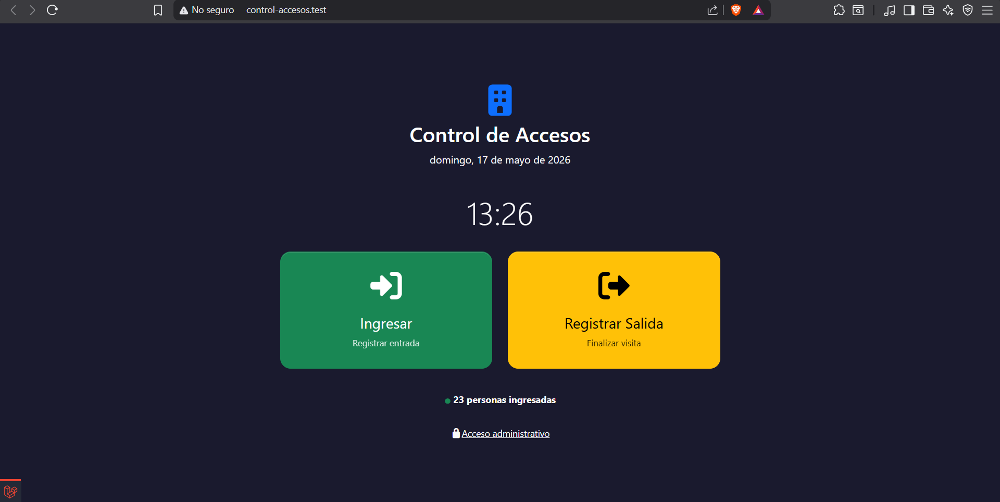

#### 🔑 Identificación
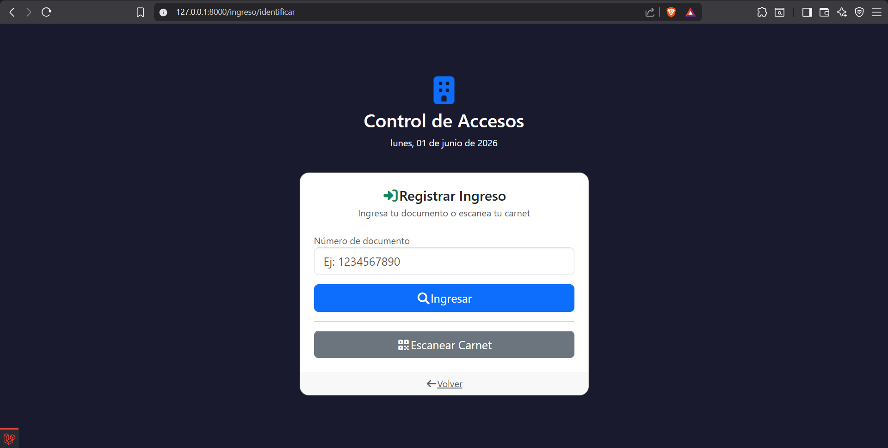

#### 📋 Seleccion de Actividad
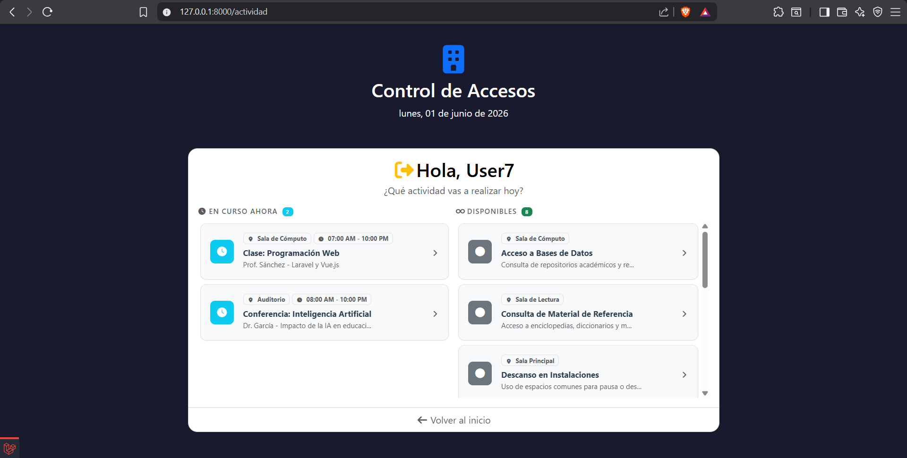

#### ✅ Confirmacion de Ingreso
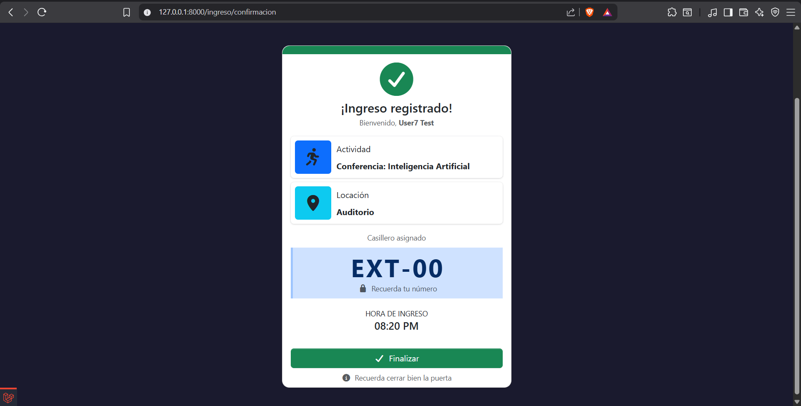

#### 🚪 Registro de Salida
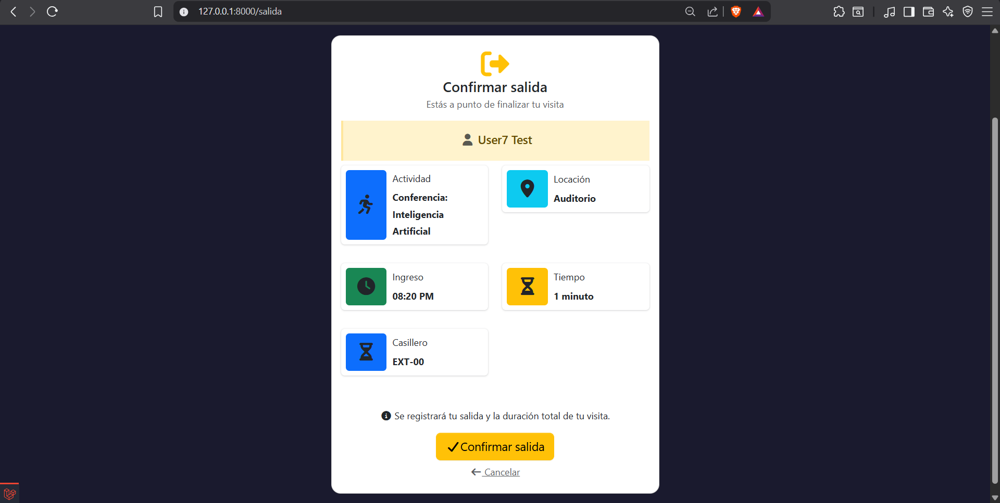

#### ⭐ Calificacion
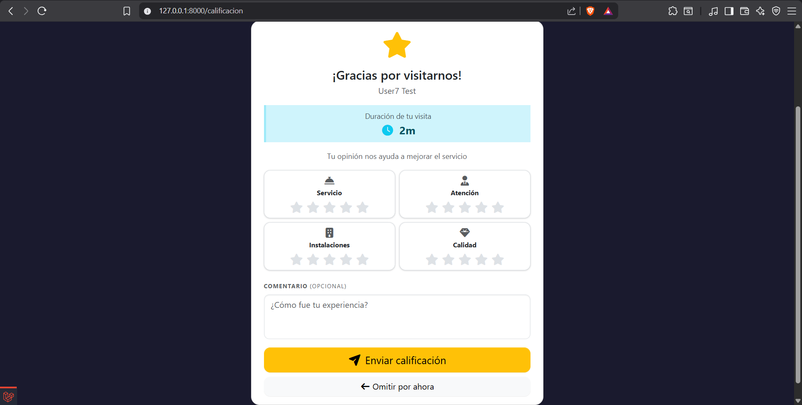

#### 👑 Panel de Administracion

##### Dashboard
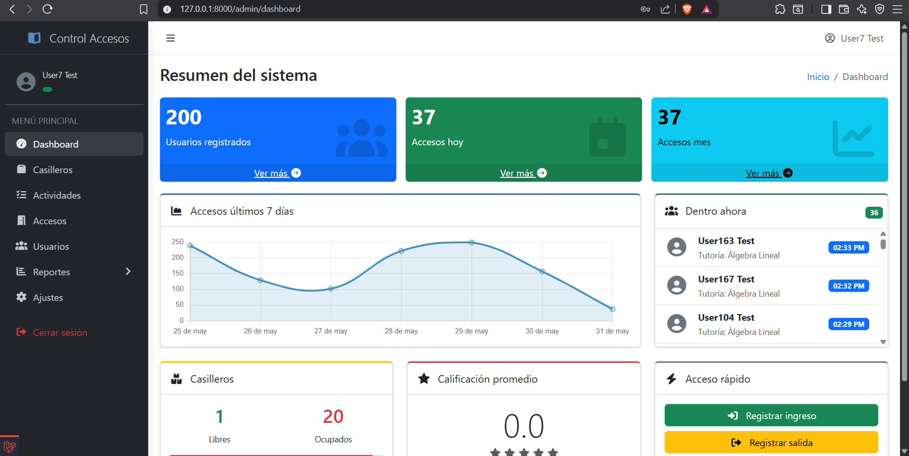

##### Gestion de Usuarios
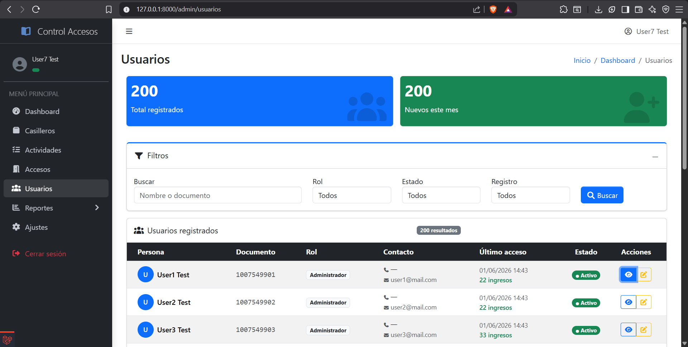

##### Programacion de Actividades
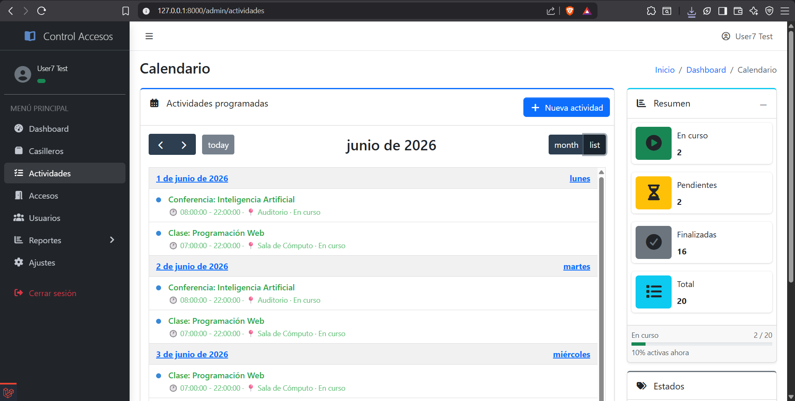

##### Reportes - Resumen


##### Reportes - Historico
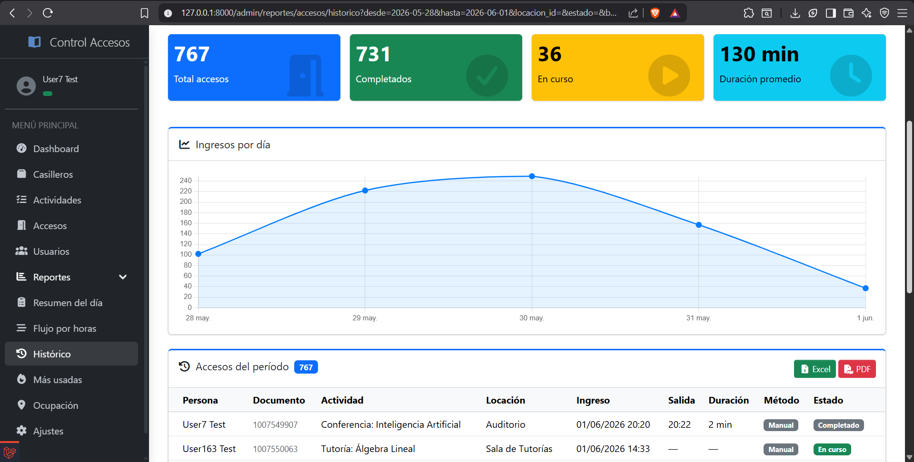

##### Exportacion PDF
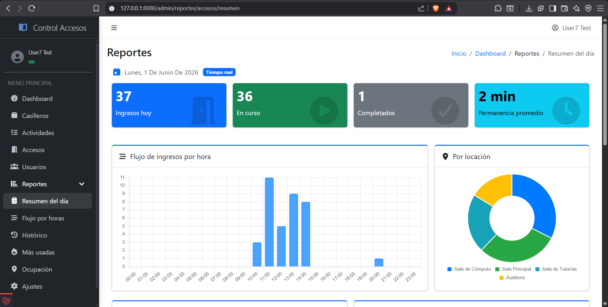
